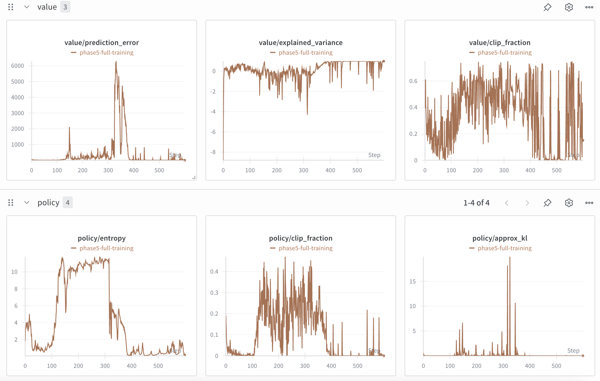

### Experiment setup
#### ppo config:
- learning_rate: 1e-5             -- How fast the model learns
- batch_size: 16,                 -- Number of samples per update
- mini_batch_size: 4              -- Subset size for gradient updates
- ppo_epochs: 1                   -- How many times to reuse each batch
- gradient_accumulation_steps: 1  -- Steps before applying gradients
- cliprange: 0.2                  -- Policy update clipping threshold
- cliprange_value: 0.2            -- Value function update clipping
- vf_coef: 0.1                    -- Weight of value loss in total loss
- target_kl: 0.1                  -- KL divergence stopping criterion
- seed: 42                        -- Reproducibility
- log_with: "wandb"               -- Logging backend
- adap_kl_ctrl: True              -- Adaptive KL penalty
- init_kl_coef: 1                 -- Initial KL penalty coefficient

#### generation parameters
- num_updates = 600
- batch_size = 16
- max_new_tokens = 32  
- temperature = 0.7
- top_p = 0.9

#### reward
length of generated query, the shorter the respond, the higher the reward
```
q = query.split()
length = len(q)
reward = 2 - length/16
```

### experiment 1
#### training description
Set low target kl (0.1), and very strick kl penalty (1).
Use output length as reward.

#### training results



#### Detailed Analysis

**Reward Optimization Success:**
- Clear upward trend from ~0.5 to ~1.8
- Shows the model is successfully learning to generate shorter responses

**KL Divergence Control - CRITICAL FAILURE:**
- Negative KL warning for 122/600 updates: UserWarning: KL divergence is starting to become negative: -30.55 - this might be a precursor for failed training. sometimes this happens because the generation kwargs are not correctly set. Please make sure that the generation kwargs are set correctly, or review your training hyperparameters.
- This is highly unusual behaviour - mathematically impossible, indicates numerical instability
- Extreme high KL values (20-300) far exceeding target_kl (0.1)
- Policy changing drastically from reference model
- Adaptive KL control mechanism completely failing

**Value Function Instability - MAJOR ISSUE:**
- Massive spikes reaching 3000+ around steps 300-400
- This is extremely unstable and indicates the value function is completely failing to predict returns
- Value function cannot adapt to rapidly changing reward distribution
- Causes unreliable advantage estimates, leading to poor policy updates

**Policy Loss Volatility:**
- Shows significant spikes (up to 1.2) around the same period
- More volatile than ideal, but not as severe as value loss
- Indicates noisy policy updates

**Entropy Collapse - EXPLORATION LOSS:**
- Rapid drop from ~11 to near 0 and stays there
- Model becomes too deterministic too quickly
- Reduces exploration capacity, potentially missing better solutions
- High clip fraction (0.2-0.4+) indicates many updates being clipped

**Policy Advantages - SURPRISINGLY STABLE:**
- Maintains near-zero values (~0 to -0.006) which is ideal
- Single spike around step 150 when value function lagged policy changes
- Recovery to near-zero shows healthy PPO dynamics
- Actually the most stable metric in the entire training

#### Root Cause Analysis

1. **Learning Rate Too High**: `1e-5` is too aggressive for the sharp reward landscape created by length-based rewards
2. **Inadequate KL Control**: Despite `init_kl_coef: 1`, the reward signal overwhelms KL penalties
3. **Sharp Reward Landscape**: Length-based rewards create discontinuous optimization surface

#### Conclusion:
While reward optimization is successful, the underlying training dynamics are quite unstable. The training suffers from:
- Failure of KL divergence control
- Severe value function instability  
- Loss of exploration through entropy collapse
- Numerical instability leading to impossible negative KL values

**Training Status**: Successful reward optimization but fundamentally unstable process that could lead to training collapse or unreproducible results.

### experiment 2
#### training description
Reduced learning rate from 1e-5 to 1e-6 while keeping all other hyperparameters identical to experiment 1.
Testing if more conservative learning rate can achieve stable training.

#### training results


#### Detailed Analysis

**Training Stability - DRAMATICALLY IMPROVED:**
- **Value Loss**: Extremely stable throughout training, staying consistently low (~0.5-3.0 range)
- **Policy Loss**: Much more stable, oscillating gently around 0-0.015 range  
- **Total Loss**: Dominated by stable value loss, showing consistent training dynamics
- **No catastrophic spikes**: Complete elimination of the massive instabilities from experiment 1

**KL Divergence Control - MIXED RESULTS:**
- **Much more controlled**: KL values stay in manageable -3 to +1 range
- **Persistent negative KL**: Most updates show KL between 0 to -3, which is still concerning
- **No extreme spikes**: Eliminated the dangerous 20-300 KL spikes from experiment 1
- **Better but not perfect**: Still indicates some numerical/computational issues

**Value Function Performance - EXCELLENT:**
- **Prediction Error**: Stable and low throughout training (1-4 range vs 14+ in experiment 1)
- **Explained Variance**: Steady improvement from -6 to 0, indicating value function learning well
- **Clip Fraction**: Very low and stable, showing appropriate update magnitudes

**Policy Behavior - STABLE BUT LIMITED LEARNING:**
- **Entropy**: More gradual decline from ~1.8 to ~2.5, maintaining some exploration
- **Clip Fraction**: Very low (~0.01), indicating small, conservative policy updates
- **Approx KL**: Consistently low (~0.0005), showing minimal policy changes

**Reward Learning - CONCERNING LACK OF PROGRESS:**
- **Minimal improvement**: Reward stays mostly flat around 0.9-1.2 range
- **No clear learning trend**: Unlike experiment 1's clear upward trajectory
- **Model barely adapting**: Learning rate may now be too conservative

#### Stability vs Learning Trade-off Analysis

**What We Gained:**
✅ **Eliminated catastrophic instabilities** (value loss spikes, extreme KL divergence)  
✅ **Stable value function** learning and prediction  
✅ **Controlled policy updates** without dangerous divergence  
✅ **Reproducible training** without numerical issues  
✅ **Better entropy management** maintaining exploration longer  

**What We Lost:**
❌ **Minimal reward optimization** - model not learning the task effectively  
❌ **Slow adaptation** to reward signals  
❌ **Potential under-exploration** of policy space  
❌ **Learning efficiency** significantly reduced  

#### Root Cause Analysis

1. **Over-Conservative Learning Rate**: `1e-6` may be too small for meaningful policy updates
2. **Reward Signal Insufficient**: Weak gradients not strong enough to drive learning
3. **KL Penalty Dominance**: KL control now overpowering reward optimization  
4. **Exploration-Exploitation Balance**: Too much emphasis on stability, insufficient exploration

#### Negative KL Persistence

The persistent negative KL (-3 to 0) suggests:
- **Computational precision issues**: Even with stable training, some numerical problems remain
- **Reference model drift**: Possible issues with reference model consistency  
- **Log probability calculations**: Still some instability in probability computations
- **Not immediately dangerous**: Unlike experiment 1, these are manageable magnitudes

#### Conclusion:
Experiment 2 successfully solved the stability issues but at the cost of learning effectiveness. The 10x learning rate reduction created a **stable but under-performing training regime**. 

**Key Finding**: Need to find the optimal learning rate between 1e-6 (too conservative) and 1e-5 (too aggressive).

**Training Status**: Stable training achieved but insufficient task learning - requires learning rate tuning.

### experiment 3
#### training description
Testing whether reward magnitude affects training stability. All hyperparameters identical to experiment 1 (learning rate back to 1e-5), but reward scaled down by factor of 0.1.
- Original reward: `reward = 2 - length/16`
- Scaled reward: `reward = (2 - length/16) * 0.1`

Hypothesis: Smaller reward values might reduce gradient magnitudes and improve stability.

#### training results


#### Detailed Analysis

**Training Stability - NO IMPROVEMENT:**
- **Value Loss**: Identical pattern to experiment 1 - massive spikes reaching 2000+ around steps 200-300
- **Policy Loss**: Same volatility pattern with spikes up to 0.8+ during unstable periods
- **Total Loss**: Dominated by value loss instabilities, showing identical dynamics to experiment 1

**KL Divergence Control - SAME FAILURE PATTERN:**
- **Extreme KL spikes**: Values reaching 250+ around steps 200-300, identical to experiment 1
- **Negative KL periods**: Same problematic negative KL values during unstable phases
- **Pattern identical**: KL control failing in exactly the same way as experiment 1

**Value Function Performance - SAME INSTABILITIES:**
- **Prediction Error**: Massive spikes reaching 3000+ matching experiment 1 pattern
- **Explained Variance**: Same dramatic drops during instability periods
- **Clip Fraction**: High values during unstable periods, same as experiment 1

**Policy Behavior - IDENTICAL PROBLEMS:**
- **Entropy**: Same rapid collapse pattern from ~4 to near 0
- **Clip Fraction**: High values (~0.3-0.5) during unstable training phases
- **Approx KL**: Same extreme spikes up to 12+ during instability

**Reward Learning - SCALED BUT SAME PATTERN:**
- **Clear learning trend**: Strong upward trajectory from ~0.05 to ~0.18 (scaled version of 0.5→1.8)
- **Learning effectiveness**: Model still successfully learns to generate shorter responses
- **Scaling confirmation**: Reward values exactly 0.1x of experiment 1, confirming correct implementation

#### Critical Finding: Reward Magnitude Irrelevant to Stability

**Key Insight**: Scaling reward by 0.1 had **zero effect** on training stability. All instability patterns from experiment 1 are perfectly reproduced:

✅ **Hypothesis Disproven**: Small reward values do NOT improve training stability  
✅ **Learning Rate is Key**: Confirms that learning rate (1e-5) is the critical factor  
✅ **Reward Scaling Works**: Model learns proportionally scaled rewards correctly  
✅ **Gradient Magnitude Theory Invalid**: Smaller rewards don't reduce problematic gradient magnitudes  

#### Root Cause Analysis Confirmation

This experiment definitively rules out **reward magnitude** as a stability factor:

1. **Learning Rate Dominates**: 1e-5 creates instability regardless of reward scale
2. **Gradient Flow Issues**: Instability stems from optimization dynamics, not reward values
3. **Policy Update Size**: Learning rate controls update magnitudes, not reward scale
4. **Value Function Adaptation**: Struggles with optimization landscape shape, not reward range

#### Conclusion:
Experiment 3 provides crucial negative evidence: **reward magnitude does not affect training stability**. All instabilities from experiment 1 are perfectly reproduced despite 10x smaller rewards.

**Definitive Finding**: Learning rate (not reward scale) controls training stability in this PPO setup.

**Training Status**: Confirms that learning rate optimization is the critical path forward - reward engineering is not the solution.

### experiment 4
#### training description
Testing interaction between learning rate and KL penalty. Based on experiment 2's stability but poor learning, reduced KL penalty to encourage more policy updates.
- Learning rate: 1e-6 (same as experiment 2 - stable)
- KL penalty: init_kl_coef reduced from 1.0 to 0.5
- All other hyperparameters identical to experiment 2

Hypothesis: Lower KL penalty will allow more policy exploration while maintaining stability from low learning rate.

#### training results


#### Detailed Analysis

**Training Stability - MAINTAINED:**
- **Value Loss**: Remains stable like experiment 2, no catastrophic spikes
- **Policy Loss**: Similarly controlled, maintaining the stability benefits of lr=1e-6
- **Total Loss**: Stable training dynamics preserved

**Reward Learning - STILL MINIMAL:**
- **Marginal improvement**: Less than 0.1 improvement, similar to experiment 2
- **Insufficient learning**: KL penalty reduction did not meaningfully improve task learning
- **Learning rate bottleneck**: 1e-6 appears to be the limiting factor, not KL penalty

**KL Divergence - INCREASED NEGATIVE VALUES:**
- **Expanded range**: KL now between 0 to -15 (vs 0 to -3 in experiment 2)
- **More negative**: Lower KL penalty allows larger policy deviations
- **Still problematic**: Negative KL values indicate persistent numerical issues

**Entropy Behavior - UNEXPECTED INCREASE:**
- **Higher entropy**: Increased to ~5 (vs stable 2-3 in experiment 2)
- **More exploration**: Policy maintaining more randomness/exploration
- **Positive sign**: Indicates policy is less deterministic

#### Key Insights from KL and Entropy Changes

**What the KL Change (0~-3 → 0~-15) Means:**
1. **Policy Diverging More**: Lower KL penalty allows policy to deviate further from reference
2. **Computational Issues Amplified**: More negative KL suggests numerical instability growing
3. **Expected Behavior**: Reduced penalty should increase KL magnitude
4. **Still Controlled**: Unlike experiment 1's extreme spikes, this is gradual increase

**What the Entropy Increase (2-3 → 5) Means:**
1. **More Exploration**: Policy maintaining higher randomness in outputs
2. **Less Deterministic**: Model not collapsing to single response pattern
3. **Positive Development**: Better exploration could lead to better solutions
4. **KL Penalty Effect**: Lower penalty allows more diverse policy outputs

#### Root Cause Analysis

**KL Penalty Reduction Effects:**
✅ **Successfully increased exploration** (higher entropy)  
✅ **Maintained training stability** (no value loss spikes)  
✅ **Allowed more policy deviation** (expanded KL range)  
❌ **Did not improve learning** (reward still flat)  

#### Critical Finding: KL Penalty vs Learning Rate Hierarchy

**Key Insight**: Reducing KL penalty affects **exploration behavior** but not **learning speed**:

🎯 **Learning Rate**: Controls magnitude of policy updates (how much change)  
🎯 **KL Penalty**: Controls direction/freedom of policy updates (what kind of change)  
🎯 **Hierarchy**: Learning rate dominates - without sufficient magnitude, direction doesn't matter  

#### Interpretation of Results

**Why Entropy Increased:**
- **Exploration space expanded**: Lower KL penalty allows more diverse outputs
- **Less premature convergence**: Policy not forced into narrow solutions
- **Positive for future**: Higher entropy provides foundation for learning if gradients increase

**Why KL Became More Negative:**
- **Computational precision**: Larger policy deviations exacerbate numerical issues
- **Expected direction**: Lower penalty should increase KL magnitude
- **Still manageable**: Unlike experiment 1, this is gradual increase not explosive

#### Conclusion:
Experiment 4 confirms that **learning rate is the primary bottleneck**, not KL penalty. Reducing KL penalty successfully increased exploration (higher entropy) and policy freedom (larger KL range) while maintaining stability, but failed to improve learning because the learning rate (1e-6) remains too conservative.

**Key Finding**: KL penalty and learning rate have **different roles** - learning rate controls learning speed, KL penalty controls exploration behavior.

**Training Status**: Stable training maintained, exploration improved, but learning rate still needs optimization for meaningful task progress.
